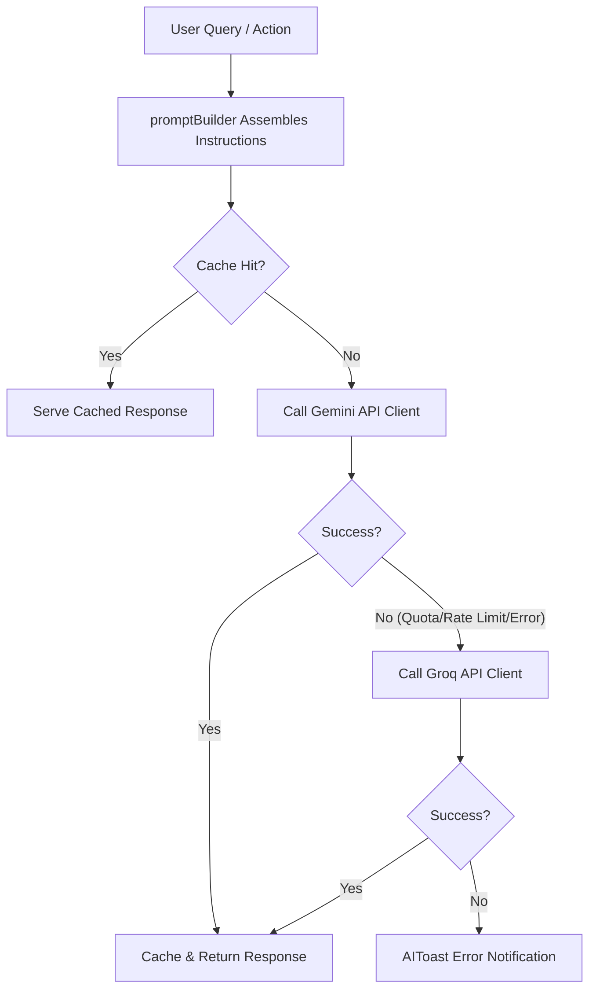

# EpitomeTRC - AI System Technical Documentation

This documentation outlines the architecture, data flows, and configurations for the integrated AI System on the **`feature/frontend`** branch.

---

## 📂 Folder Structure

```text
apps/web/src/
├── lib/
│   └── ai/
│       ├── providers/
│       │   ├── gemini.ts            # Google Generative Language API integration
│       │   ├── groq.ts              # Groq chat completions API integration (Fallback)
│       │   └── providerFactory.ts   # Instantiates requested AI provider client
│       ├── services/
│       │   ├── aiService.ts         # Orchestrator (handles sanitization and caching)
│       │   ├── cacheManager.ts      # In-memory prompt response cache
│       │   ├── contextBuilder.ts    # Page path mapping configuration
│       │   ├── fallbackManager.ts   # Quota/failover routing controls
│       │   ├── knowledgeBase.ts     # EpitomeTRC official training, jobs & service data
│       │   └── promptBuilder.ts     # Assembles system instructions and inputs
│       ├── constants.ts             # Default models and core system prompts
│       ├── types.ts                 # TypeScript type interfaces
│       └── utils.ts                 # Markdown JSON parsers & string sanitizers
├── components/
│   └── ai/                          # Custom reusable AI UI components
│       ├── FloatingAIButton.tsx     # Global circular pulsing assistant trigger
│       ├── AIChatWindow.tsx         # ChatGPT-style dialog layout
│       ├── AIToast.tsx              # Error notifications overlay
│       ├── AIConsultantWidget.tsx   # Business solution consultant
│       ├── AITalentMatchWidget.tsx  # Recruiter search rank & candidate summaries
│       ├── AIResumeMatchWidget.tsx  # Student ATS keyword match calculator
│       └── AICohortPlannerWidget.tsx# Admin training planner
```

---

## 🔄 Gemini ⇆ Groq Fallback Flow

All AI operations utilize an automatic provider failover mechanism:



---

## 🔑 Configure API Keys

API keys are loaded securely from `.env` in the server layer and are never exposed to the client bundle.

### 📝 Where to Paste the Keys
Add these lines to the configuration file **`apps/web/.env`**:

```env
# ===== PASTE YOUR GEMINI API KEY HERE =====
GEMINI_API_KEY="PLACEHOLDER_GEMINI_KEY"

# ===== PASTE YOUR GROQ API KEY HERE =====
GROQ_API_KEY="PLACEHOLDER_GROQ_KEY"
```

---

## 🚀 Adding Future AI Providers

The system is designed following the Open-Closed Principle. To add a new provider (e.g., OpenAI):

1. **Create Client**: Add a new client file under `lib/ai/providers/openai.ts`:
   ```typescript
   export async function callOpenAIProvider(prompt: string, options?: ProviderOptions): Promise<AIResponse> {
     // Implement native fetch call...
   }
   ```
2. **Update Factory**: Update `lib/ai/providers/providerFactory.ts` to register the new provider type:
   ```typescript
   if (providerName === "openai") {
     return callOpenAIProvider(prompt, options);
   }
   ```
3. **Register Fallback**: Update the sequence inside `lib/ai/services/fallbackManager.ts` to include it in the retry chain.
